<div align="center">
  
</div>

<div align="center">
  ✦ where mathematics becomes art ✦
</div>

<div align="center">
◦ ─ ∿ ─ ◦ ─ ∿ ─ ◦
</div>

_Generative art & geometric animations : built entirely with Python's turtle library_

<br/>

[](https://github.com/Aaricacoding/TurtleAnimations)
[](https://python.org)
[](https://docs.python.org/3/library/turtle.html)
[](https://github.com/Aaricacoding/TurtleAnimations)
[](LICENSE)

> _"The universe is written in the language of mathematics,_
> _and its characters are triangles, circles, and geometric figures."_
> — **Galileo Galilei**

<br/>

⭐ **If this project sparks your imagination, please star the repo!** ⭐

</div>

---

## ✦ What Is TurtleAnimations?

**TurtleAnimations** is a curated gallery of generative art and geometric animations — crafted entirely with Python's built-in `turtle` library. No game engine, no GPU renderer, no external dependencies. Just math, code, and curiosity.

> **Every script is a standalone mathematical poem that draws itself on screen.**

---

## 📦 Project Structure

```
TurtleAnimations/
│
├── 📄  README.md
├── 🐍  main.py                        ← Interactive launcher menu
├── 🐍  setup_structure.py             ← Repo scaffolding script
│
├── ⚙️  core/                          ← Shared engine
│   ├── config.py                      ← Canvas settings + Config class
│   ├── fractal_engine.py              ← mandelbrot(), julia(), L-systems
│   └── renderer.py                    ← Turtle setup + Renderer class
│
├── 🌿  fractals/
│   ├── mandelbrot_visualizer.py       ← Vivid gradient Mandelbrot set
│   └── julia_set_explorer.py          ← Neon cyan-pink Julia set
│
├── 🎮  interactive/
│   ├── keyboard_fireworks.py          ← Press keys → fireworks
│   ├── lissajous_controller.py        ← Real-time Lissajous figures
│   └── mouse_painter.py              ← Draw with your cursor
│
├── 📦  legacy/
│   ├── parametric_heart.py
│   ├── arc_weave.py
│   ├── aurora_dots.py
│   ├── colorburst_sunflower.py
│   ├── crazy_dancing_arcs.py
│   ├── crescent_cardioid.py
│   ├── geometricRainbow_wheel.py
│   ├── golden_spirograph.py
│   ├── orbital_flower_pattern.py
│   ├── oscillator.py
│   ├── oscillator2.py
│   ├── star_tetrahedron.py
│   ├── starburst_orbit.py
│   └── sunburst_spiral.py
|
├── 🌀  Torus/
│   ├── lotusOf_life.py
│   └── torus_vortex.py
|
├── 🌊  physics/
│   ├── engine.py                      ← Simulation loop
│   ├── forces.py                      ← Gravity + wind
│   ├── galaxy.py                      ← N-body galaxy sim
│   ├── interactions.py                ← Mouse gravity well
│   ├── neon.py                        ← Glow renderer
│   ├── particles.py                   ← Particle base class
│   ├── presets.py                     ← Firework scene
│   ├── vectors.py                     ← Vector field
│   └── [vectors.py](http://vectors.py)
│
├── 🧊  projections/
│   ├── camera.py                      ← Rotating 3D wireframe cube
│   ├── perspective.py                 ← 3D star field
│   ├── transform.py                   ← Spinning octahedron
│   └── viewport.py                    ← Pulsing isometric grid
│
└── 🗂️  assets/
    ├── fonts/                         ← Font demo scripts
    ├── palettes/                      ← JSON colour palettes
    ├── previews/                      ← Screenshots
    └── exports/                       ← Canvas exports
```

---

## 🎨 Legacy Animations — Where It All Started

<div align="center">

|        Animation        |            File             | Description                               | Complexity |
| :---------------------: | :-------------------------: | :---------------------------------------- | :--------: |
|   💖 Parametric Heart   |    `parametric_heart.py`    | Heart from parametric equations           |    ⭐⭐    |
|      🌀 Arc Weave       |       `arc_weave.py`        | Interlocking circular arc patterns        |   ⭐⭐⭐   |
|     🌌 Aurora Dots      |      `aurora_dots.py`       | Flowing aurora-style particle waves       |   ⭐⭐⭐   |
| 🌻 Colorburst Sunflower |  `colorburst_sunflower.py`  | Golden angle spiral with vibrant coloring |  ⭐⭐⭐⭐  |
|  💃 Crazy Dancing Arcs  |   `crazy_dancing_arcs.py`   | Dynamic rotating arc animations           |   ⭐⭐⭐   |
|  🌙 Crescent Cardioid   |   `crescent_cardioid.py`    | Cardioid-based crescent geometry          |   ⭐⭐⭐   |
|    🌈 Rainbow Wheel     | `geometricRainbow_wheel.py` | Full-spectrum rotating color wheel        |   ⭐⭐⭐   |
|  🧿 Golden Spirograph   |   `golden_spirograph.py`    | Harmonic circular interference patterns   |  ⭐⭐⭐⭐  |
|    🌸 Orbital Flower    | `orbital_flower_pattern.py` | Rotating petal interference pattern       |   ⭐⭐⭐   |
|      〰️ Oscillator      |       `oscillator.py`       | Simple harmonic motion visualization      |    ⭐⭐    |
|    〰️ Oscillator II     |      `oscillator2.py`       | Multi-frequency oscillation patterns      |   ⭐⭐⭐   |
|   ✡️ Star Tetrahedron   |    `star_tetrahedron.py`    | Sacred geometry projection                |  ⭐⭐⭐⭐  |
|   ✨ Starburst Orbit    |    `starburst_orbit.py`     | Radial orbiting burst animation           |   ⭐⭐⭐   |
|   ☀️ Sunburst Spiral    |    `sunburst_spiral.py`     | Fermat spiral using golden angle          |  ⭐⭐⭐⭐  |

</div>

---

## 🌀 Torus Explorations

<div align="center">

| Animation        | File              | Description                                                  |
| ---------------- | ----------------- | ------------------------------------------------------------ |
| 🌸 Lotus of Life | `lotusOf_life.py` | Layered circular symmetry forming lotus-like sacred geometry |
| 🌪️ Torus Vortex  | `torus_vortex.py` | Rotating toroidal flow illusion using layered arcs           |

</div>

---

## 🌿 Fractals

Mathematical infinity made visible — recursive boundary structures with vivid gradient colouring.

<div align="center">

|          Animation           | What you see on screen                                                                                                                                                                                                                                                               |
| :--------------------------: | :----------------------------------------------------------------------------------------------------------------------------------------------------------------------------------------------------------------------------------------------------------------------------------- |
| 🌑 **Mandelbrot Visualizer** | The classic Mandelbrot set rendered in a 4-stop gradient: **black interior → electric blue → vivid purple → hot orange → white-yellow** at the fastest-escaping edges. The iconic seahorse valleys and bulb spirals appear in deep blue-purple.                                      |
|  🔵 **Julia Set Explorer**   | A Julia set for seed `c = -0.7 + 0.27015i` — the classic spiral variant. Coloured in a **cyan → purple → hot-pink → white** neon gradient. The interior is near-black, with bright neon tendrils radiating outward. Change `c` in the script to explore completely different shapes. |

</div>

> 💡 **Both fractals take ~1–2 minutes to render** — this is normal. Watch the rows fill in progressively in the terminal.

---

## 🌊 Physics Simulations

A full physics engine built on turtle — each file is both a reusable module **and** a standalone visual demo.

<div align="center">

|         File         | What you see when you run it                                                                                                                                                            |
| :------------------: | :-------------------------------------------------------------------------------------------------------------------------------------------------------------------------------------- |
|    ⚙️ `engine.py`    | **Neon particle fountain** — 8 streams of coloured particles spray outward from the bottom centre, arc under gravity, and fade out. Demonstrates the Engine loop.                       |
|    💨 `forces.py`    | **Neon snowstorm** — hundreds of white/cyan snowflakes fall from the top, drifting sideways as wind direction randomly shifts every few seconds.                                        |
| 🧲 `interactions.py` | **Mouse gravity well** — 60 orbiting coloured particles circle the screen. Move your mouse to pull them toward your cursor like a gravity well.                                         |
|     🌟 `neon.py`     | **Neon Lissajous ribbon** — a glowing trail traces a Lissajous figure (3:2 frequency ratio) in cycling neon colours, fading as it moves.                                                |
|    🌌 `galaxy.py`    | **N-body galaxy** — 300 stars orbit a central mass. Stars are pulled toward the centre by gravity, creating spiral arm patterns over time.                                              |
|   🎆 `presets.py`    | **Firework show** — coloured firework bursts launch from random positions, expand outward, and fade under gravity in a continuous loop.                                                 |
|   📐 `vectors.py`    | **Animated curl vector field** — a grid of arrows across the whole canvas points in directions defined by `sin`/`cos` functions that evolve over time, creating a flowing field effect. |

</div>

---

## 🧊 3D Projections

A hand-rolled 3D pipeline — no libraries, just math turning 3D coordinates into 2D turtle drawings.

<div align="center">

|        File         | What you see when you run it                                                                                                                                                         |
| :-----------------: | :----------------------------------------------------------------------------------------------------------------------------------------------------------------------------------- |
|   📷 `camera.py`    | **Rotating wireframe cube** — a 3D cube with 12 rainbow-coloured edges rotates continuously around both X and Y axes using perspective projection. Each edge is a different colour.  |
| 🔭 `perspective.py` | **3D star field** — 200 stars at random 3D depths rotate slowly. Stars closer to you appear larger and brighter; distant ones are tiny. Creates a galaxy flythrough effect.          |
|  🔄 `transform.py`  | **Spinning octahedron** — a 3D octahedron (6 vertices, 12 edges) rotates with slightly different X and Y angular speeds, giving it a tumbling motion. Edges cycle through 6 colours. |
|  🖥️ `viewport.py`   | **Pulsing isometric grid** — a 7×7 grid of diamond shapes pulses in and out using a `sin` wave, with each diamond a different colour from the palette.                               |

</div>

---

## 🚀 Getting Started

```bash
# Clone
git clone https://github.com/Aaricacoding/TurtleAnimations.git
cd TurtleAnimations

# Launch the menu (recommended)
python main.py

# Or run any file directly
python fractals/mandelbrot_visualizer.py
python physics/galaxy.py
python projections/camera.py
```

> 💡 `turtle` is built into Python — no `pip install` needed. Python 3.6+ required.

---

## 🧮 The Math Behind the Magic

<div align="center">

|      Animation      | Core Formula                                                   |
| :-----------------: | :------------------------------------------------------------- |
| 💖 Parametric Heart | `x = 16sin³t` · `y = 13cos(t) − 5cos(2t) − 2cos(3t) − cos(4t)` |
| ☀️ Sunburst Spiral  | Fermat's spiral `r = a√θ` · golden angle `φ = 137.508°`        |
|    🌑 Mandelbrot    | `zₙ₊₁ = zₙ² + c`, `z₀ = 0` — iterate until `\|z\| > 2`         |
|    🔵 Julia Set     | `zₙ₊₁ = zₙ² + c`, fixed `c`, varying `z₀`                      |
|    〰️ Lissajous     | `x = A·sin(aτ + δ)` · `y = B·sin(bτ)`                          |
|      🌌 Galaxy      | `F = Gm₁m₂ / r²` · velocity-Verlet integration                 |
|   📐 Vector Field   | `vx = sin(y·k + t)` · `vy = cos(x·k + t)`                      |
|     🧊 3D Cube      | Rotation matrices + perspective divide `f = FOV / depth`       |

</div>

---

## 📅 Status

<div align="center">

[](https://github.com/Aaricacoding/TurtleAnimations)

**30+ scripts and growing.** New animations added regularly — watch the repo to get notified.

</div>

---

## 🔭 Coming Soon

<div align="center">

|      Category      | Upcoming                                                            |
| :----------------: | :------------------------------------------------------------------ |
|  🌿 **Fractals**   | Dragon Curve · Koch Snowflake · Barnsley Fern · Sierpiński Triangle |
|     🧊 **3D**      | Platonic solids · Torus wireframe · Morphing polyhedra              |
| 🎮 **Interactive** | Real-time kaleidoscope · Gravity well painter                       |
|   🌊 **Physics**   | Double pendulum · Wave interference · Lorenz attractor              |

</div>

---

## 🤝 Contributing

1. Fork the repo
2. Place your script in the correct category folder
3. Add a docstring with the math concept used
4. Submit a pull request

Rules: `turtle` only · one `.py` file · `if __name__ == "__main__"` block required.

---

## 💫 Show Your Support

<div align="center">

**If this project inspired you, made you smile, or taught you something —**

### ⭐ Please Star the Repo ⭐

[](https://github.com/Aaricacoding/TurtleAnimations/stargazers)

</div>

---

## 📜 License

MIT — free to use, modify, and share. Just spread the beauty. 🎨

---

<div align="center">

_Made with_ 🐢 _Python Turtle · Math · Love_

`✦ more animations loading... ✦`

</div>
